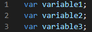
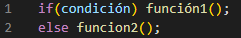
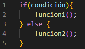
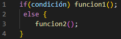
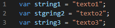
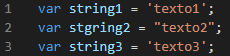
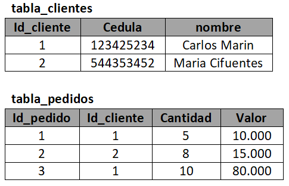
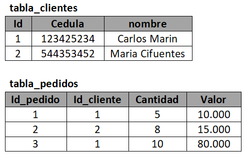

# Criterios de Aceptación Internos

## Esatandares de Desarrolllo

> :bulb: **Trabajo en equipo:**
>
> _Fomentar un ambiente de trabajo en equipo y colaboración, lo que puede ayudar a mejorar la comunicación, la creatividad y la resolución de problemas._

> _Realiza revisiones y pruebas: Realiza revisiones periódicas para garantizar que se estén cumpliendo los estándares de desarrollo. También es importante realizar pruebas para verificar la calidad y la eficacia del software._

### ISO 9001:

Es un estándar internacional de calidad que se aplica a todos los sectores y establece los requisitos para un sistema de gestión de calidad efectivo. Esto incluye la gestión de procesos, la mejora continua y la satisfacción del cliente.

### ISO/IEC 12207:

Este estándar describe el ciclo de vida del software y establece los procesos y actividades necesarios para desarrollar, mantener y operar el software de manera efectiva. Es una guía para la planificación, la gestión, el diseño, la implementación, la prueba y el mantenimiento del software.

### Agile:

Agile es un marco de trabajo para el desarrollo de software que se basa en la colaboración, la iteración y la retroalimentación continua. Se centra en la entrega rápida y constante de software de alta calidad y se basa en principios como la comunicación, la simplicidad y la adaptabilidad.

### ITIL:

ITIL (Information Technology Infrastructure Library) es un conjunto de mejores prácticas para la gestión de servicios de TI. Proporciona un marco para la gestión de servicios de TI y se centra en la entrega de servicios de TI eficientes y efectivos.

### CMMI:

Capability Maturity Model Integration (CMMI) es un modelo de mejora de procesos que se utiliza para evaluar y mejorar la capacidad y madurez de los procesos de una organización. Se centra en la mejora continua y la optimización de los procesos de la organización para aumentar la eficiencia y la calidad de los productos y servicios.

---

## Buenas Practicas

La implementación de las mejores prácticas en organizaciones de diferentes sectores, trae muchos beneficios como:

- Minimizan errores.
- Facilitan el eficaz uso de recursos.
- Ayudan a obtener mejores resultados.
- Beneficio a la organización de los participantes del proyecto.
- El buen uso garantiza el éxito.

Las buenas prácticas, son un concepto que se puede aplicar ampliamente y en diferentes gamas de industrias. En el mundo de los negocios, el término se aplica en conexión con todo, desde la gestión de proyectos hasta las funciones de auditoría o desarrollo de software.

Se ha demostrado que las mejores prácticas son la forma más eficiente de trabajar. Estas se definen de manera rígida en algunos sectores, mientras que en otros su aplicación puede ser más flexible.

Independientemente de la complejidad de las mejores prácticas, el objetivo es hacer que lo que se esté aplicando funcione mejor, más rápido y de manera eficiente con menos problemas y errores. Es por eso que siempre es una buena idea estar al tanto de cuáles son las mejores prácticas para lo que se está tratando de lograr. Es un marco para el éxito y la minimización de riesgos.

### :computer: Código

| Item | Buena Practica                                                                                                                                                                                                                                                                  | Ejemplo Buena Practica                                                          | Ejemplo Mala Practica                                                         |
| ---- | ------------------------------------------------------------------------------------------------------------------------------------------------------------------------------------------------------------------------------------------------------------------------------- | ------------------------------------------------------------------------------- | ----------------------------------------------------------------------------- |
| 1    | Identar adecuadamente el Código.                                                                                                                                                                                                                                                |                                                                                 |                                                                               |
| 2    | Nombrar las variables y funciones con nombres descriptivos que representen lo que hacen, esta practica permite entender el código escrito por otra persona de forma más rápida.                                                                                                 |                                                                                 |                                                                               |
| 3    | Agregar comentarios descriptivos al código ayuda tanto a otros desarrolladores como a nosotros mismos cuando revisamos líneas de código escritas tiempo atrás.                                                                                                                  |                                                                                 |                                                                               |
| 4    | Si se van a declaras varias variables que no se les va a asignar ningún valor al momento de ser declaradas, es una buena practica usar solo una vez la palabra reservada var o let, y luego colocar todas las declaraciones de variables separadas por coma.                    |  |  |
| 5    | Separar el código repetitivo en funciones que pueden ser reutilizadas, esto reduce las líneas de código y hace que sea más entendible, además de mejorar el rendimiento.                                                                                                        |                                                                                 |                                                                               |
| 6    | Cuando se usan condicionales if/else que contienen una sola línea de código es una buena practica omitir los corchetes y colocar el código que se va a ejecutar en la misma línea, esto con el fin de reducir la cantidad de líneas de código, esto también aplica para el else |  |  |
| 7    | Cuando se usan condicionales if/else es una buena practica que el código a ejecutar en el else tenga el mismo formato que en el if y viceversa.                                                                                                                                 |  |  |
| 8    | Es una buena mantener la misma estructura que ya se esta manejando dentro de un código que ya se encuentra escrito, por ejemplo cuando se usan comillas simples y comillas dobles en Javascript.                                                                                |  |  |

### :ledger: Bases de Datos

| Item | Buena Practica                                                                                                 | Ejemplo Buena Practica                                                             | Ejemplo Mala Practica                                                            |
| ---- | -------------------------------------------------------------------------------------------------------------- | ---------------------------------------------------------------------------------- | -------------------------------------------------------------------------------- |
| 1    | Siempre que se crea una tabla nueva se le debe asignar una Primary key.                                        |                                                                                    |                                                                                  |
| 2    | La columna de una tabla que sirve para enlazar con otra, debe mantener el nombre que tiene la tabla principal. |  |  |
| 3    | Nombrar las tablas con nombres descriptivos.                                                                   |  |  |