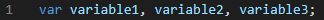
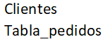

# Criterio de Aceptación Interna

## Estándares de Calidad
_Los estandares son ciertas pautas que se adoptaron para conseguir uniformidad en el desarrollo, facilitando el mantenimiento y la actualización de los aplicativos y portales, evitando la dependencia de un desarrollador._

> :bulb: **Trabajo en equipo:**
>
> _Fomentar un ambiente de trabajo en equipo y colaboración, lo que puede ayudar a mejorar la comunicación, la creatividad y la resolución de problemas._

> _Realiza revisiones y pruebas: Realiza revisiones periódicas para garantizar que se estén cumpliendo los estándares de desarrollo. También es importante realizar pruebas para verificar la calidad y la eficacia del software._

### ISO 9001: 
Es un estándar internacional de calidad que se aplica a todos los sectores y establece los requisitos para un sistema de gestión de calidad efectivo. Esto incluye la gestión de procesos, la mejora continua y la satisfacción del cliente.
Este estándar describe el ciclo de vida del software y establece los procesos y actividades necesarios para desarrollar, mantener y operar el software de manera efectiva. Es una guía para la planificación, la gestión, el diseño, la implementación, la prueba y el mantenimiento del software.

- Identificación de la necesidad de un plan de calidad
- Identificación de las entradas 
- Alcance 
- Preparación 
- Contenido 
- Revisión, aceptación e implementación

### TIPO DE DATOS:
Todo lenguaje de programación posee una definición para cada tipo de dato que permite
identificar el atributo que soporta y el tamaño de la información que puede contener. Los datos
mas comunes empleados por la mayoría de lenguajes de programación se denominan “Primitivos”
estos tipos de datos son: 

### METODOLOGÍA BPMN:

Implementar la metodologia BPMN en cada proceso que se lleve a cabo en la empresa una modelado, automatización, ejecución, control, medición y optimización de los flujos de actividades de negocio para conseguir los objetivos de la empresa, involucrando sistemas,  empleados, clientes y socios dentro y fuera de los límites de la empresa.

### METODOLOGÍA ÁGIL
- **EXTREME PROGRAMMING (XP)**: Esta herramienta es muy útil sobre todo para startups o empresas que están en proceso de consolidación, puesto que su principal objetivo es ayudar en las relaciones entre los empleados y clientes. La clave del éxito del Extreme Programming XP es potenciar las relaciones personales, a través, del trabajo en equipo, fomentando la comunicación y eliminando los tiempos muertos.

    - Planificación del proyecto con el cliente
    - Diseño del proyecto
    - Codificación, donde los programadores trabajan en pareja para obtener resultados más eficientes y de calidad
    - Pruebas para comprobar que funcionan los códigos que se van implementando.
    

- **SCRUM**: Esta metodología permite abordar proyectos complejos que exigen una flexibilidad y una rapidez esencial a la hora de ejecutar los resultados.  La estrategia irá orientada a gestionar y normalizar los errores que se puedan producir en desarrollos demasiado largos, a través de, reuniones frecuentes para asegurar el cumplimiento de los objetivos establecidos.
    

- **KANBAN**: muy útil para los responsables de proyectos. Esta consiste en la elaboración de un cuadro o diagrama en el que se reflejan tres columnas de tareas; pendientes, en proceso o terminadas. Este cuadro debe estar al alcance de todos los miembros del equipo, evitando así la repetición de tareas o la posibilidad de que se olvide alguna de ellas. 

    - Planificación de tareas
    - Mejora en el rendimiento de trabajo del equipo
    - Métricas visuales
    - Los plazos de entregas son continuos
    

### TALENTOS Y RECURSOS APROPIADOS
En este punto no sólo se refiere a tener las personas apropiadas para un cargo sino en tener los equipos apropiados, hardware moderno, plataformas de desarrollo y herramientas para pruebas para que el equipo pueda realizar sus labores sin dificultades extra. 

 
### CICLO DE VIDA DEL SOFTWARE
Escoger el proceso de desarrollo adecuado y atenerse a este permitirá la culminación exitosa del proyecto. Metodologías para el desarrollo de software hay muchas, pero cumplir estrictamente lo que en ellas está descrito puede mejorar el desarrollo del ciclo de vida.  
    

### EVALUAR PRESUPUESTO CORRECTAMENTE 
Esto depende mucho de los recursos, el tiempo de ciclo de vida del software y la fijación de un cronograma. Lo mejor es seguir metodologías ya probadas para realizar estimaciones. 

### DEFINICIÓN DE REQUISITOS 
Documentar las funcionalidades es la forma de obtener productos alineados con las necesidades del cliente. Si bien la teoría de casos de uso o la consideración de requerimientos funcionales y no funcionales suena aburrida, es necesario que el equipo pueda comprender estos para el diseño de la arquitectura, pruebas, etc. 

### DIVIDIR LAS TAREAS EN PEQUEÑOS HITOS 
Las tareas pequeñas van complementando un actividad o hito y son más fáciles de manejar. Es adecuado amarrar estas tareas a hitos grandes para conocer las dependencias entre estas y culminar el proyecto considerando la mayor cantidad de posibilidades. 
 
### OPTIMIZACIÓN DEL DISEÑO DE LA APLICACIÓN  
Técnicas como la reutilización del código o utilizar enfoque orientados a objetos o  módulos permite que el proyecto no se rompa. 

### PRUEBAS Y VALIDACIONES 
Estas validaciones permiten encontrar errores, detectar posibles problemas de seguridad y entender si funciona correctamente un desarrollo a implementar. Documentar los errores encontrados, el rastreo de estos tempranamente y las pruebas unitarias son estándares para el manejo de pruebas.  

### DOCUMENTACIÓN 
Esto permite a las partes interesadas conocer a fondo las funcionalidades del software desarrollado,  a realizar una trazabilidad de estas y eliminar la dependencia del equipo de desarrollo original, para que otras personas aprendan de este conocimiento o se solucionen de manera efectiva futuros inconvenientes. Se deben documentar diseños, pruebas, funcionalidades, especificaciones y documentación para usuarios. 

### CONTROL DE VERSIONES 
Muy importante para el control de las versiones de los módulos a desarrollar, inclusive en casos de reversión del código. También se puede utilizar como parte de la trazabilidad del proyecto.  

### CONTROL DE CALIDAD 
Las métricas de cumplimiento de objetivos son indicadores para conocer el estado y completitud de un proyecto. El control de fases en el ciclo de vida del proyecto, fijar métricas y establecer objetivos son fundamentales para el control de las tareas. 

Capability Maturity Model Integration (CMMI) es un modelo de mejora de procesos que se utiliza para evaluar y mejorar la capacidad y madurez de los procesos de una organización. Se centra en la mejora continua y la optimización de los procesos de la organización para aumentar la eficiencia y la calidad de los productos y servicios.

---

## Buenas Practicas

La implementación de las mejores prácticas en organizaciones de diferentes sectores, trae muchos beneficios como:

- Minimizan errores.
- Facilitan el eficaz uso de recursos.
- Ayudan a obtener mejores resultados.
- Beneficio a la organización de los participantes del proyecto.
- El buen uso garantiza el éxito.

Las buenas prácticas, son un concepto que se puede aplicar ampliamente y en diferentes gamas de industrias. En el mundo de los negocios, el término se aplica en conexión con todo, desde la gestión de proyectos hasta las funciones de auditoría o desarrollo de software.

Se ha demostrado que las mejores prácticas son la forma más eficiente de trabajar. Estas se definen de manera rígida en algunos sectores, mientras que en otros su aplicación puede ser más flexible.

Independientemente de la complejidad de las mejores prácticas, el objetivo es hacer que lo que se esté aplicando funcione mejor, más rápido y de manera eficiente con menos problemas y errores. Es por eso que siempre es una buena idea estar al tanto de cuáles son las mejores prácticas para lo que se está tratando de lograr. Es un marco para el éxito y la minimización de riesgos.

### :computer: Código

| Item | Buena Practica                                                                                                                                                                                                                                                                  | Ejemplo Buena Practica                                                          | Ejemplo Mala Practica                                                         |
| ---- | ------------------------------------------------------------------------------------------------------------------------------------------------------------------------------------------------------------------------------------------------------------------------------- | ------------------------------------------------------------------------------- | ----------------------------------------------------------------------------- |
| 1    | Identar adecuadamente el Código.                                                                                                                                                                                                                                                |                                                                                 |                                                                               |
| 2    | Nombrar las variables y funciones con nombres descriptivos que representen lo que hacen, esta practica permite entender el código escrito por otra persona de forma más rápida.                                                                                                 |                                                                                 |                                                                               |
| 3    | Agregar comentarios descriptivos al código ayuda tanto a otros desarrolladores como a nosotros mismos cuando revisamos líneas de código escritas tiempo atrás.                                                                                                                  |                                                                                 |                                                                               |
| 4    | Si se van a declaras varias variables que no se les va a asignar ningún valor al momento de ser declaradas, es una buena practica usar solo una vez la palabra reservada var o let, y luego colocar todas las declaraciones de variables separadas por coma.                    |  |  |
| 5    | Separar el código repetitivo en funciones que pueden ser reutilizadas, esto reduce las líneas de código y hace que sea más entendible, además de mejorar el rendimiento.                                                                                                        |                                                                                 |                                                                               |
| 6    | Cuando se usan condicionales if/else que contienen una sola línea de código es una buena practica omitir los corchetes y colocar el código que se va a ejecutar en la misma línea, esto con el fin de reducir la cantidad de líneas de código, esto también aplica para el else |  |  |
| 7    | Cuando se usan condicionales if/else es una buena practica que el código a ejecutar en el else tenga el mismo formato que en el if y viceversa.                                                                                                                                 |  |  |
| 8    | Es una buena mantener la misma estructura que ya se esta manejando dentro de un código que ya se encuentra escrito, por ejemplo cuando se usan comillas simples y comillas dobles en Javascript.                                                                                |  |  |

### :ledger: Bases de Datos

| Item | Buena Practica                                                                                                                                                                                                                                                                                                                                                                                                                                                                                                                                                                                                                                   | Ejemplo Buena Practica                                                             | Ejemplo Mala Practica                                                            |
| ---- | ------------------------------------------------------------------------------------------------------------------------------------------------------------------------------------------------------------------------------------------------------------------------------------------------------------------------------------------------------------------------------------------------------------------------------------------------------------------------------------------------------------------------------------------------------------------------------------------------------------------------------------------------ | ---------------------------------------------------------------------------------- | -------------------------------------------------------------------------------- |
| 1    | Siempre que se crea una tabla nueva se le debe asignar una Primary key.                                                                                                                                                                                                                                                                                                                                                                                                                                                                                                                                                                          |                                                                                    |                                                                                  |
| 2    | La columna de una tabla que sirve para enlazar con otra, debe mantener el nombre que tiene la tabla principal.                                                                                                                                                                                                                                                                                                                                                                                                                                                                                                                                   |  |  |
| 3    | Nombrar las tablas con nombres descriptivos.                                                                                                                                                                                                                                                                                                                                                                                                                                                                                                                                                                                                     |  |  |
| 4    | Una vez que se realiza el diseño de una base datos y se establecen cuáles son las tablas y los campos2 que incluirá, es importante tener en cuenta la nomenclatura. En ocasiones, se tienen en cuenta preferencias personales más que reglas o convenciones, sin embargo, es importante mantener una nomenclatura que permita coherencia y consistencia en las notaciones. [(Buenas prácticas en el diseño de bases de datos - José Alberto Giménez - Pg. 2)](https://www.utic.edu.py/revista.ojs/index.php/revistas/article/download/86/193/106)                                                                                                |                                                                                    |                                                                                  |
| 5    | Se recomienda el uso de la notación ***snake_case***, en la cual los nombres se definen con palabras que se separan por un guion bajo ***(_)***. Esta recomendación está basada en un estudio presentado en la 18º Conferencia Internacional sobre Comprensión de Programas de la IEEE (Institute of Electrical and Electronics Engineers3 ) del año 2010, en donde se presentó un estudio empírico para determinar si las convenciones afectan la comprensión de código. [(Buenas prácticas en el diseño de bases de datos - José Alberto Giménez - Pg. 3)](https://www.utic.edu.py/revista.ojs/index.php/revistas/article/download/86/193/106) |                                                                                    |                                                                                  |
| 6    | Un detalle a tener en cuenta para la nomenclatura de campos, es que siempre debe hacerse en singular, esto surge como parte de la normalización. [(Buenas prácticas en el diseño de bases de datos - José Alberto Giménez - Pg. 4)](https://www.utic.edu.py/revista.ojs/index.php/revistas/article/download/86/193/106)                                                                                                                                                                                                                                                                                                                          |                                                                                    |                                                                                  |
| 7    | Se recomienda no usar prefijos innecesarios  (como TblEscuela, o EscuelaTabla, etc.)                                                                                                                                                                                                                                                                                                                                                                                                                                                                                                                                                             |                                                                                    |                                                                                  |
| 8    | Es bueno usar campos de tipo bit para almacenar valores booleanos.  Usar enteros o varchar repercute en un consumo innecesario de almacenamiento. [(Buenas prácticas para el uso de Bases de Datos)](https://decodigo.com/2012/02/buenas-practicas-para-el-uso-de-bases.html)                                                                                                                                                                                                                                                                                                                                                                    |                                                                                    |                                                                                  |
